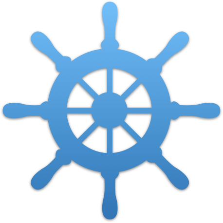
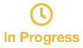

    

  <h1 align="center">Kubernetes Graphing Group</h1>

  

  <h3 align="center">Vision</h3>
  
Make Kubernetes concepts easy to undestand.

  <h3 align="center">Mission</h3>
  
Create a visual language for concept diagrams

  <h3 align="center">Status</h3>
  
M1 Initiation

  

    <a href="https://github.com/Roderick-Jonsson/k8s-diagrams/milestones?direction=asc&sort=title&state=open">Milestone Overview</a>
    ·
    <a href="https://github.com/Roderick-Jonsson/k8s-diagrams/projects/1">Task Overview</a>
    ·
    <a href="#get-involved">Get Involved</a>
  

<h2>Progress</h2>

| Progress                              | Milestone |                                                              |
| ------------------------------------- | --------- | ------------------------------------------------------------ |
|   | M1        | Initiation                                                   |
|                                       | M2        | Prioritize concepts                                          |
|                                       | M3        | Discuss possible representations for concepts & post sketches |
|                                       | M4        | Establish basic visual guidelines                            |
|                                       | M5        | Design visually consistent vector (i.e. SVG) symbols         |

<h2>Dedicated Contributors</h2>

- Roderick Jonsson
- Daniel Romlein

<h2>Get involved</h2>

**Find a contribution opportunity**
1. Check if a issue is [actively recruiting participants][issue recruiting] by looking for issues with the recruting tag

2. Check for interesting tasks by looking at the [milestone][milestone] , [task overview][task overview] and [issue list][issue list] and contact the issue assignee with your collaboration request on workbench

**How we organise our work on Github**

All work is guided by our vision statement.

1. [Milestone Planning][milestone]
  - Key points to accomplish our mission
2. [Task Creation][task overview]
  - Single actionable tasks which have to be done to reach a milestone
3. [Task status report][milestone issues]
  - Status report on single task
  - Assignees are responsible for task completion (dedicated contributors)
  - First post should help project members, contributors and prospectives to understand what the task is about and always be up to date by assignees
  - For general communication and coordination use the workbench
4. [Workbench][workbench]
  - Collaboration tool to chat and exchange information where needed

**Very useful guides for doing generall project management on GitHub**
If you have never looked in depth to using milestones, projects, wiki, tags and other features from Github to organise tasks this two guides will get you up an running in no time :)
- [Youtube: Professional Guides: Managing Projects (5min)][YT github pm short]
- [Youtube: Webcast GitHub for Project Management (59min)][YT github pm long]

[prospects file]: https://github.com/Roderick-Jonsson/k8s-diagrams/blob/master/workspace/prospects.md
[milestone]: https://github.com/Roderick-Jonsson/k8s-diagrams/milestones?direction=asc&sort=title&state=open
[task overview]: https://github.com/Roderick-Jonsson/k8s-diagrams/projects/1
[issue list]: https://github.com/Roderick-Jonsson/k8s-diagrams/issues
[issue recruiting]: https://github.com/Roderick-Jonsson/k8s-diagrams/issues?q=is%3Aissue+is%3Aopen+label%3Arecruiting
[YT github pm short]: https://www.youtube.com/watch?v=nI5VdsVl0FM
[YT github pm long]: https://www.youtube.com/watch?v=6fByt0o4UYs&t=3160s
[milestone issues]: https://github.com/Roderick-Jonsson/k8s-diagrams/issues?utf8=✓&q=is%3Aissue+is%3Aopen+milestone%3A*+
[workbench]: https://slack.com
